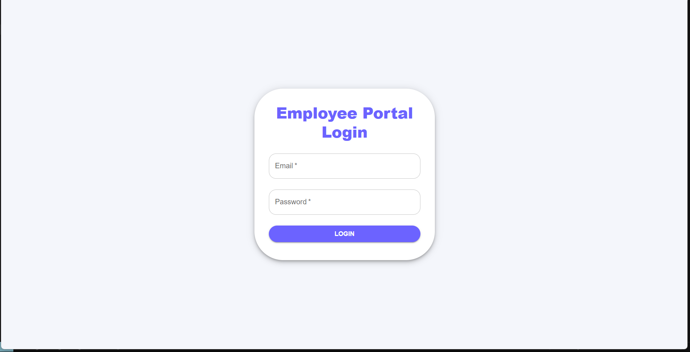
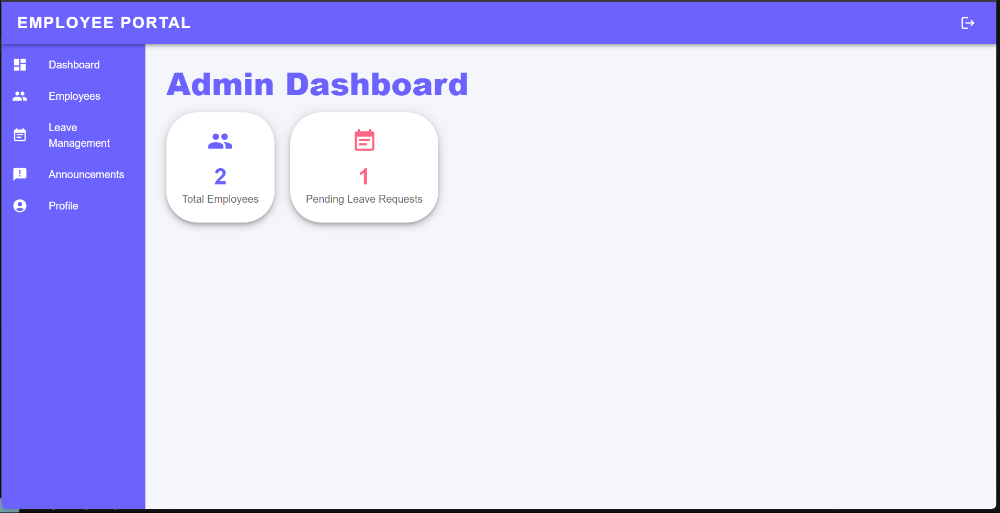
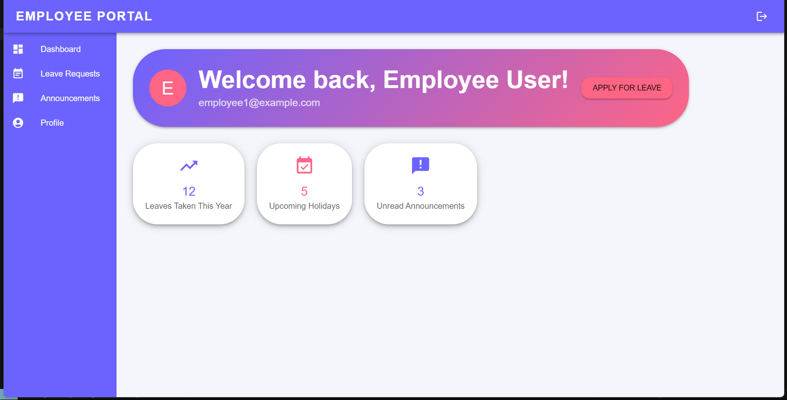
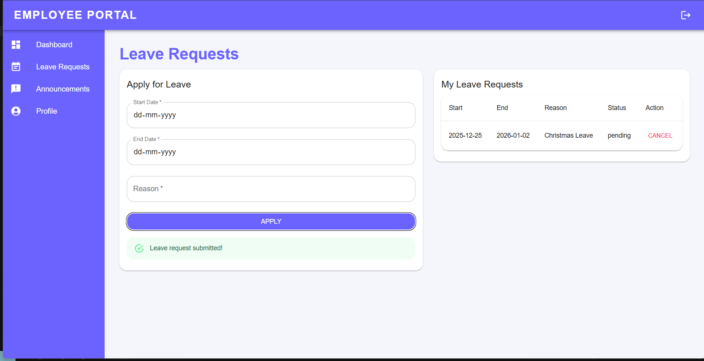
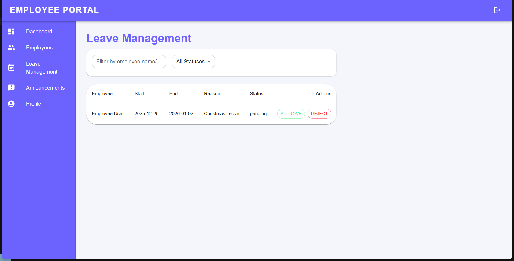
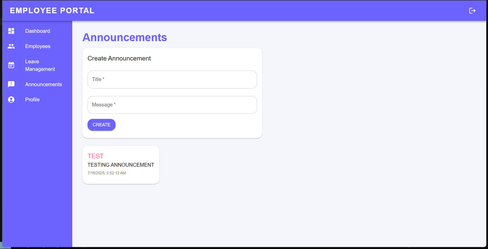

# Employee Management System

A full-stack MERN (MongoDB, Express, React, Node.js) Employee Management System.

## 🌐 Live Demo

Try the app here:  
[https://employee-management-system-ochre-seven.vercel.app](https://employee-management-system-ochre-seven.vercel.app)

## 🚀 Backend API

API is deployed at:  
[https://employee-management-system-fyah.onrender.com/api](https://employee-management-system-fyah.onrender.com/api)

## 📝 Test Credentials

- **Admin**
  - Email: `admin2@example.com`
  - Password: `yourpassword`
- *(Add more demo users if you want)*

- **Employee**
- Email: `employee1@example.com`
- Password: `employeepassword`

## 🛠️ How to Use

1. Click the [Live Demo](https://employee-management-system-ochre-seven.vercel.app) link above.
2. Log in with the test credentials.
3. Explore the features!

## 📦 Tech Stack

- **Frontend:** React (Vite), Vercel
- **Backend:** Node.js, Express, MongoDB Atlas, Render

## 📝 Screenshots

### Login Page

### Admin Dashboard

### Employee Dashboard

### Leave Requests

### Leave Management

### Announcements

## 🧑‍💻 Local Development

See [SETUP.md](SETUP.md) for instructions on running locally.

## 🙏 Contributions

Pull requests are welcome! For major changes, please open an issue first to discuss what you would like to change.

---
